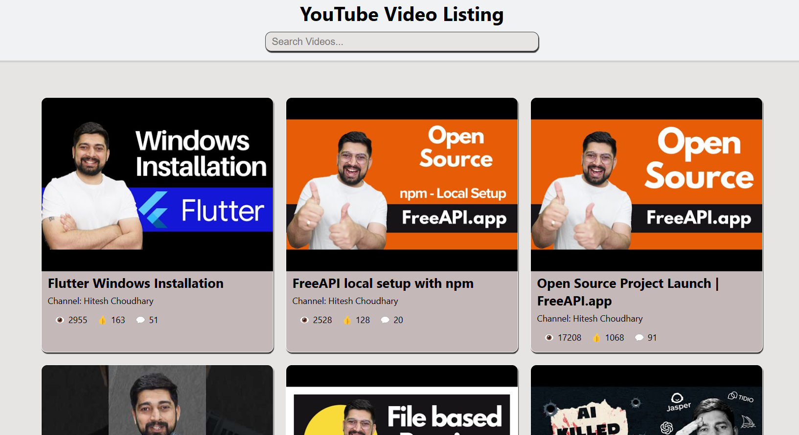

# YouTube Video Listing

## Application Features
- **Fetch YouTube Videos**: Retrieves a list of videos from an API.
- **Display Video Details**: Shows video title, channel name, thumbnail, and statistics (views, likes, comments).
- **Search Functionality**: Allows users to search for videos by title or channel name.
- **Clickable Thumbnails**: Users can click on thumbnails to watch videos on YouTube.

## Screenshots

## Deployment Link
[Live Demo](https://youtube-video-listings.netlify.app/)