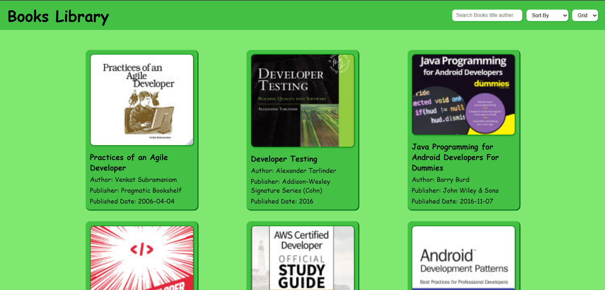
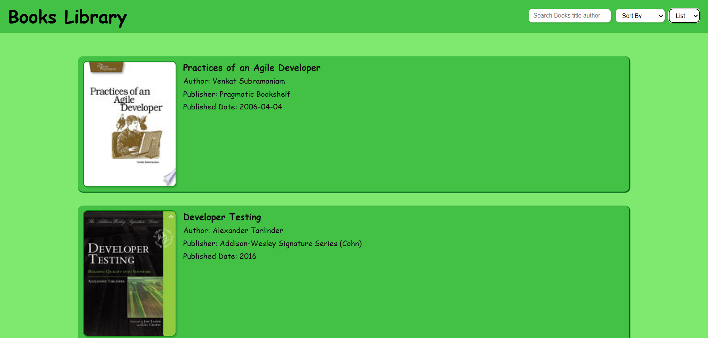

# 📚 Books Library

A simple web application that allows users to search, sort, and browse books from an external API.

## ✨ Features

- 🔍 **Search Books** – Users can search for books by title or author.
- 📚 **Sort Books** – Books can be sorted alphabetically (A-Z, Z-A) or by publication date (Newest, Oldest).
- 🎭 **View Modes** – Supports both **grid** and **list** views for better browsing experience.
- 🔄 **Pagination** – Navigate through different pages to discover more books.
- 📖 **Book Details** – Click on a book to view more information from the source.

## 🖼️ Screenshots

### Grid View  
  

### List View  
  

## 🚀 Deployment

[Live Demo](https://books-library-apps.netlify.app/)

## 🛠️ How It Works

1. **Fetching Books** – The app fetches book data from the API when the page loads and whenever pagination occurs.
2. **Displaying Books** – Books are dynamically displayed based on user preferences (view mode, sorting, and search input).
3. **Pagination System** – Users can navigate between pages using **Next** and **Previous** buttons.
4. **Sorting & Searching** – Users can refine book listings by sorting or searching for specific books.

## 🔗 API Used

- **[Free API - Books](https://freeapi.hashnode.space/api-guide/apireference/getBooks)**